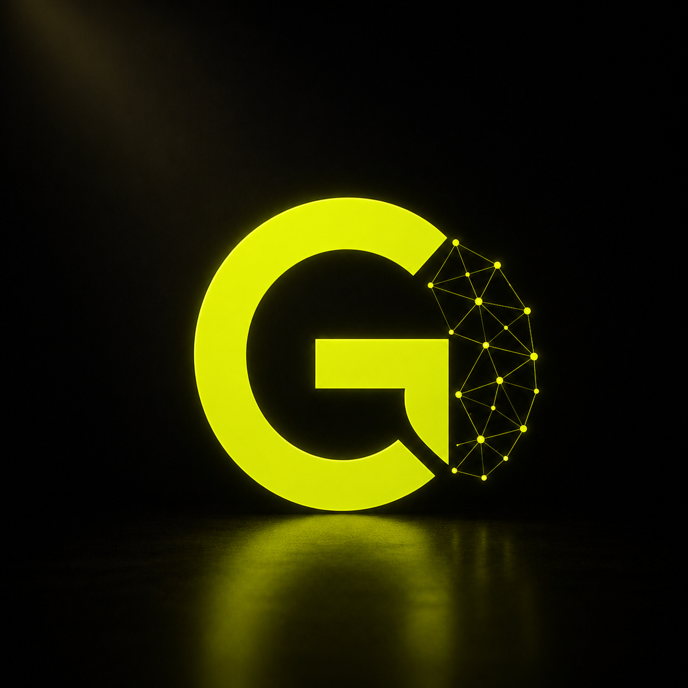

<div align="center">



# GEN.IA SQUAD — Brand Kit

**Assets oficiais de marca. Prontos para usar em qualquer projeto.**

[](https://vercel.com)
[](./public/assets/brand-kit.zip)
[](./README.md)

</div>

---

## O que é isso

Este repositório é o **home oficial dos assets de marca da GEN.IA SQUAD** — o lugar onde designers, desenvolvedores e parceiros encontram tudo que precisam para aplicar a identidade visual com consistência.

Não é um repositório de código. É uma fonte de verdade de marca.

Disponível como site público em **[brand.geniasquad.com.br](https://brand.geniasquad.com.br)** — acesse, veja, baixe. Sem login. Sem fricção.

---

## O que está incluso

### Logos — 7 variações

| Arquivo | Variação | Uso |
|---|---|---|
| `gs-icon-lime.png` | Ícone Lime | Fundos claros |
| `gs-icon-black.png` | Ícone Preto e Branco | Impressão, documentos |
| `gs-icon-black-lime.png` | Ícone Preto + Rede Lime | Versão premium |
| `gs-icon-white.png` | Ícone Branco | Fundos escuros |
| `gs-icon-glow.png` | Ícone com Glow | Impacto máximo, dark |
| `gs-wordmark-lime.png` | Wordmark completo | Nome da marca |
| `gs-logo-full-glow.png` | Logo ícone + nome | Hero sections |

### Tipografia

| Arquivo | Família | Peso |
|---|---|---|
| `Gilroy-ExtraBold.otf` | Gilroy | 800 — Display e wordmark |
| `Gilroy-Light.otf` | Gilroy | 300 — Títulos leves |

> **Geist** (corpo) e **Geist Mono** (código) são open-source — [vercel.com/font](https://vercel.com/font)

### Tokens CSS

```css
:root {
  --gs-lime:        #d1ff00;  /* Destaque principal */
  --gs-black:       #050505;  /* Fundo base */
  --gs-surface:     #0f0f11;  /* Superfície de cards */
  --gs-cream:       #f5f4e7;  /* Texto principal */
  --gs-blue:        #0099ff;  /* Ações secundárias */
  --gs-flare:       #d96a3f;  /* Alertas, novidades */
}
```

Todos os tokens em `public/assets/tokens.css` — incluído no brand kit.

---

## Estrutura do repositório

```
geniasquad-brand/
│
├── public/                    # Servido pela Vercel
│   ├── index.html             # Página pública do brand kit
│   └── assets/
│       ├── logos/             # PNGs de todas as variações
│       ├── fonts/             # Gilroy ExtraBold + Light
│       ├── tokens.css         # Variáveis CSS da paleta
│       └── brand-kit.zip      # Gerado no build (não versionado)
│
├── scripts/
│   └── build-kit.js           # Gera brand-kit.zip (Node puro, sem deps)
│
├── vercel.json                # Config de deploy, headers, redirect /brand-kit
└── package.json
```

---

## Deploy na Vercel

### Setup inicial

```bash
# 1. Clone o repositório
git clone https://github.com/elidyizzy/geniasquad-brand.git
cd geniasquad-brand

# 2. Importe na Vercel (uma vez)
vercel link
```

### Configuração na Vercel

| Campo | Valor |
|---|---|
| Build Command | `node scripts/build-kit.js` |
| Output Directory | `public` |
| Install Command | *(deixar vazio)* |

A cada push na `main`, a Vercel roda o build, gera o `brand-kit.zip` atualizado e publica automaticamente.

### Desenvolvimento local

```bash
npm install
npm run dev
# Abre em http://localhost:3000
```

---

## Atualizar a marca

### Adicionar ou substituir um logo

```bash
# Coloque o novo PNG em:
public/assets/logos/gs-[nome].png

# Regenere o zip:
node scripts/build-kit.js

# Commit e push — Vercel deploya automaticamente
git add public/assets/logos/gs-[nome].png
git commit -m "brand: adiciona variação [nome] do logo"
git push
```

### Atualizar as fontes

```bash
# Substitua os arquivos em:
public/assets/fonts/

# Regenere o zip e faça push
node scripts/build-kit.js
git add public/assets/fonts/
git commit -m "brand: atualiza fontes"
git push
```

> O `brand-kit.zip` é gerado automaticamente no build da Vercel — nunca suba o zip manualmente.

---

## Brand Guidelines

A documentação completa da marca está em [`BRAND.md`](https://github.com/elidyizzy/geniasquad-creators/blob/main/designsystem/brand/BRAND.md) no repositório principal, incluindo:

- Missão, valores e personalidade da marca
- Regras de uso do logo (área de proteção, tamanho mínimo, usos incorretos)
- Paleta de cores com WCAG e contrastes
- Escala tipográfica e regras de aplicação
- Tom de voz por contexto
- Exemplos de código CSS e aplicações

---

## Sobre a GEN.IA SQUAD

**GEN.IA SQUAD** constrói squads de agentes de inteligência artificial para automatizar, acelerar e potencializar operações de negócio.

Não somos uma ferramenta. Somos um time.

> "Estrutura é sagrada. Tom é flexível."

- Site: [geniasquad.com.br](https://geniasquad.com.br)
- GitHub: [@elidyizzy](https://github.com/elidyizzy)

---

<div align="center">

**GEN.IA SQUAD © 2026 — Todos os direitos reservados**

*Os assets de marca deste repositório são de propriedade exclusiva da GEN.IA SQUAD.*  
*O uso é autorizado exclusivamente para aplicações que representam a GEN.IA SQUAD.*  
*Redistribuição ou uso em marcas de terceiros é proibido.*

</div>
